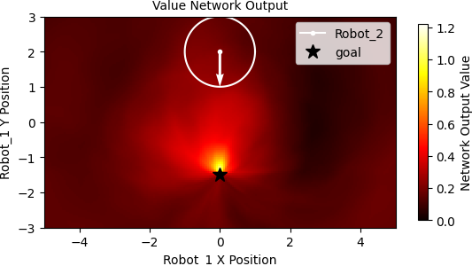
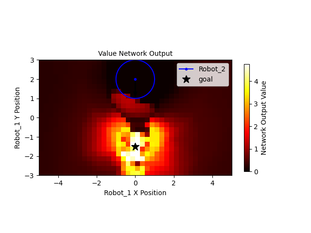
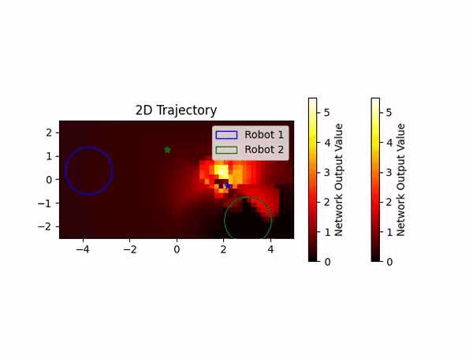
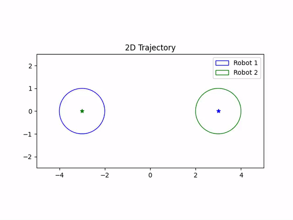
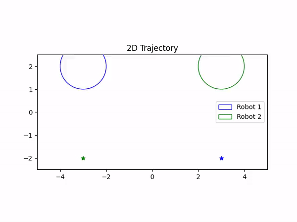
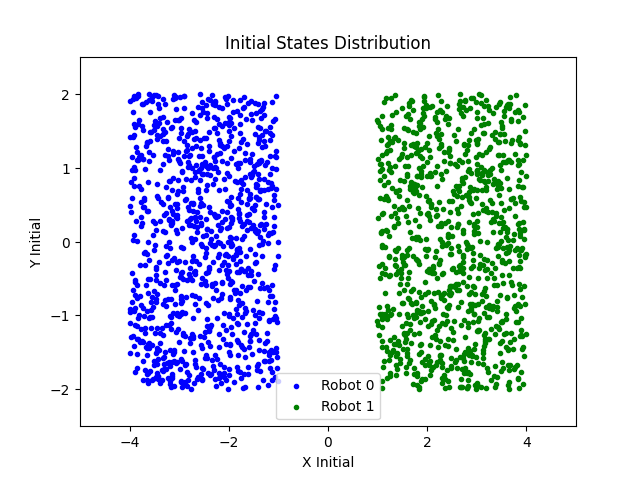
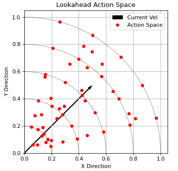
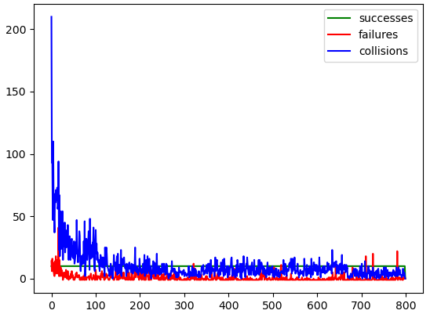

## AA 277: Multi-Robot Control and Distributed Optimization
Programmers: [Torstein Eliassen](https://github.com/gravlaks), [Brian Dobkowski](https://github.com/bdobkowski), [Bradley Collicott](https://github.com/bcollico)

## Project: Deep Reinforcement Learning for Collision Avoidance
This project implements a scheme for learning collision-avoiding behavior in a two-robot system. Following the approach by Yu Fan Chen et. al. in [Decentralized Non-communicating Multiagent Collision Avoidance with Deep Reinforcement Learning](https://arxiv.org/pdf/1609.07845.pdf), we use inverse reinforcement learning on [ORCA](https://gamma.cs.unc.edu/ORCA/publications/ORCA.pdf) example trajectories followed by randomized Deep V-Learning to approximate the optimal collision avoiding value function.

### Results
The value function is visualized using heatmaps where the position of the second robot is fixed on the plane. From left to right, the images below show the value function learned from Inverse Reinforcement Learning on ORCA examples, the value funciton learned from Deep V-Learning, the value function of robot 1 changing over time on a representative trajetory.

     &nbsp;&nbsp;&nbsp;&nbsp;&nbsp;&nbsp;&nbsp;&nbsp;&nbsp;&nbsp;&nbsp;&nbsp;

A control policy can be extracted from the learned value function by performing a one-step lookahead and selecting the action with the highest sum of rewards and discounted future returns. Example trajectories produced using the Deep V-Learning value function are shown below.

     &nbsp;&nbsp;&nbsp;&nbsp;&nbsp;&nbsp;

### Implementation 
#### Inverse Reinforcement Learning
ORCA trajectories were generated using C++ source code provided by the original authors. Details are provided below. 1000 example trajectories were created with a distribution of initial states and goal states as shown:

     &nbsp;&nbsp;&nbsp;&nbsp;&nbsp;&nbsp;

These trajectories produced approximately 106,000 truth labels for training the initial value network. The process was carried out for 1000 epochs to 'learn' the implicit value function associated with the ORCA algorithm.

#### Deep V Learning
Using the learned value function from the previous step, iterative policy evaluation and iteration was carried out using an ε-Greedy exploration-exploitation strategy. With ε linearly decreasing from ε0=0.5. During the rollout, a random action is selected with probability ε, otherwise an action is selected greedily from a constrained action search space. The constrained space, shown below, limits robot movements to reasonable kinematic motion. Training was carried out for 800 episodes, replacing 'expert' experiences with learned experiences over the course of training. Each training episode was run until the value function produced 10 collision-avoiding trajectories - the number of attempts in each episode is also plotted below:

     &nbsp;&nbsp;&nbsp;&nbsp;&nbsp;&nbsp;

#### Generating Training Data using RVO2 (ORCA)
ORCA source code was obtained from the [public RVO2 repository](https://github.com/snape/RVO2). The following instructions (and associated Linux commands) can be used to produce the binary executable for generating a set of randomized ORCA trajectories. Ensure that you re-compile after making any changes to the c++ source code.

These steps may be executed in a single line:

     mkdir build && cd build && cmake .. && make
     
1. Create and navigate to the build folder
2. Build the RVO2 and data creation script    
3. Compile the code
      
The executable will be generated as `build/src/Generate_Training_Data`. Execute the code from the root directory to produce `data/training_data.csv`.
